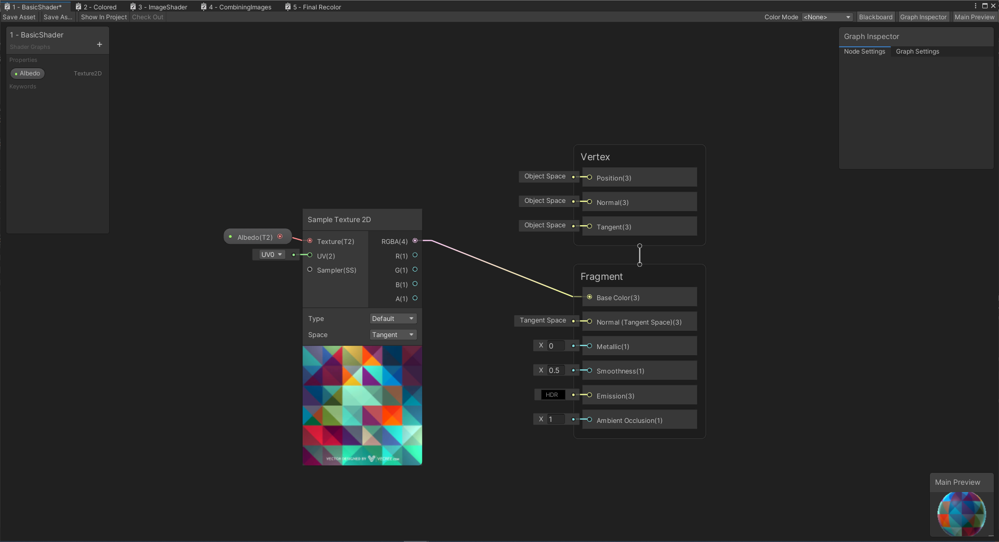

# 1. Hello Shaders

Hello world, this post will briefly discuss what a shader graph in Unity is and introduces a very basic shader. If you
want additional resources about shaders, look into Unity's [2 Shader Graph](https://unity.com/shader-graph) introduction.

The goal of these examples is to slowly introduce concepts and eventually teach how the Recolor Shader shown at the
start of the project works. Each example adds a small amount of complexity to the process. 

The next example in this tutorial is [Colored Shaders](2.ColoredShaders.md) which goes over adding basic colors to a
shader and material.

## Scene Example

This example concerns Scene `1 - Hello Shaders` in the `Assets/Recolor/Scenes` folder in the project. This scene contains three
sample boxes that have an image drawn on each face. Below is a sample image of the scene:

Inside of this scene, there are three cubes each of which has a different material applied to it. A material describes
how something should look by using a **shader** and **properties**. A shader gives instructions on how something should
look in 3D space using properties to configure different versions.

Each of the boxes (from left to right) in this scene use the materials defined in the folder `Assets/Recolor/Materials`:
* 1 - Basic Material Square
* 1 - Basic Material Pattern
* 1 - Basic Material pattern 2

## Basic Shader

Each of these materials uses the same shader, `1 - BasicShader` saved at `\Assets\Shaders\1 - BasicShader.shadergraph`.
This shader has one property, a texture (aka image). This texture is simply drawn onto each face of the cube. The different
materials listed earlier each have a different texture property value. 

A graph of how this shader is applied is shown below:

The left side panel of this page defines the properties (of which there is only one, Texture 2D). In the middle, you can see
a few boxes. The box on the left has a patten texture drawn below it. The top of each box has the name of the action and
the inputs and output. The bottom of the panel has a preview of what is happening at this step. The lines drawn between
panels represent passing data to different steps within the shader.  

The `Sample Texture 2D` action simply takes an image and draws it on the faces of the object using something called a
UV mapping. The UV Mapping describes where pixes in the image are draw on the object and can be modified in 3D modeling
programs such as blender. 

On the right side of the main view, there is another panel called `Fragment`. This panel is where can can modify
properties of how our object will look. Since we are just recoloring an object, will will only be concerned with the
`Base Color(3)` input. The reason it has a (3) at the end of the name is because a color is described using 3 values
(red, green, blue). You can use something like [Google Color Picker](https://g.co/kgs/QYQs5R) to see how red green and
blue can combine to make any color imaginable.

Feel free to grab a new texture from `Assets/Recolor/Textures` and modify an object in teh scene. Experiment with this basic
shader and applying a new texture to the model. 

## Next Tutorial - Colored Shader

The next example in this tutorial is [Colored Shaders](2.ColoredShaders.md) which goes over adding basic colors to a
shader and material.
