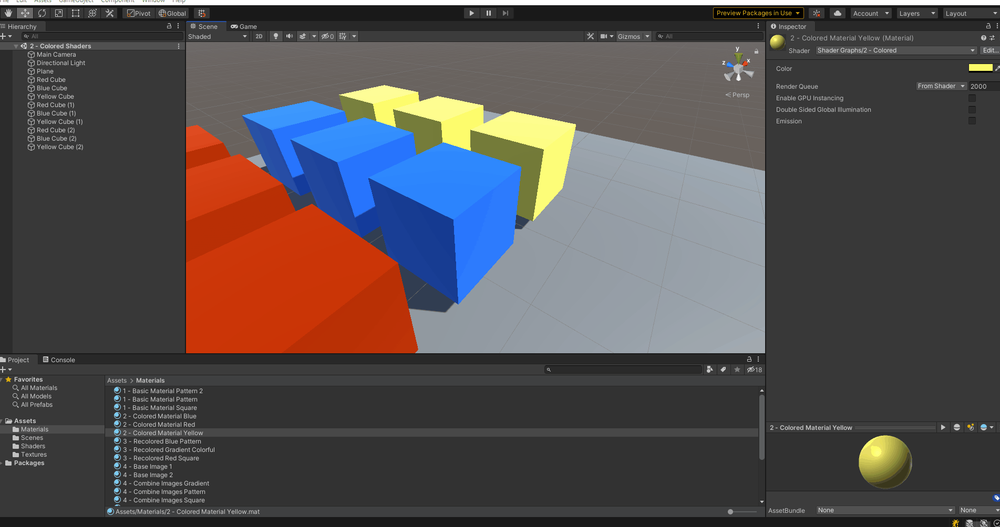
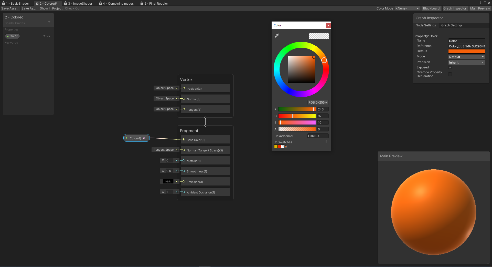

# 2. Colored Shader

Now that we have covered the basics of what a shader is, this example covers adding colors to shaders. For this example
we will simply create a shader that applies a solid color to a given object. From this we can define multiple materials
each with a different associated color.

The previous example in this tutorial is [1 Hello Shader](1.HelloShader.md) which goes over the basics of a shader. 
The next example in this tutorial is [3 Recolor Images](3.RecoloringImages.md) which goes over adding basic colors to a
shader and material.

## Scene Example

This example concerns Scene `2 - Colored Shaders` in the `Assets/Recolor/Scenes` folder in the project. This scene contains nine
sample boxes in a 3x3 grid where each colum of boxes uses the same material:

Each column of boxes has the same material applied to it. The three materials used in this scene are (found in the
`Assets/Recolor/Materials` folder):
* 2 - Colored Material Red
* 2 - Colored Material Blue
* 2 - Colored Material Yellow

An interesting thing to note, the same material is applied to three boxes and if this material is edited, it will be
reflected in all boxes that use this material. For example, if the yellow shader has its color property changed to
green, all yellow boxes will change to the color green. This is shown in the simple animation below:

## Colored Shader

Now that we have seen the results of modifying this material, let's go into the shader that this material uses,
`2 - Colored` defined at `Assets/Recolor/Shaders/2 - Colored.shadergraph`. This shader simply has 1 parameter, color, and this
color is applied to the entire object everywhere (no Sample Texture 2D node required). 

In the diagram above, the value of the input Color(4) can be modified to have any color. The reason this has a (4)
instead of the (3) for Base Color is because we have a new value, alpha, which represents the transparency of the image.
We will be ignoring alpha for this tutorial as transparent images and shaders will be a future topic. 

As seen in the animation earlier, we can select a material within Unity and modify properties to change how all objects
using that material look.

## Next Example - Recoloring Images

Now we have a basic understanding of how to add a color property to our shaders. 
The next example in this tutorial is [Recolor Images](3.RecoloringImages.md) which goes over how to recolor an image in
a shader and material.
