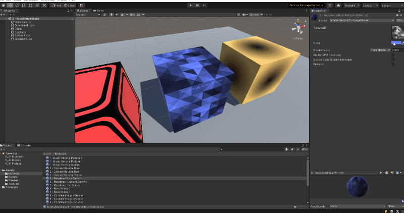
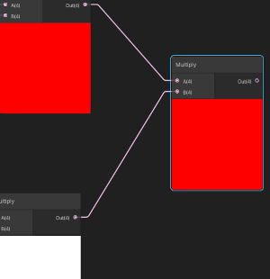
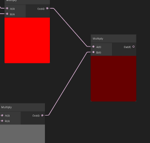
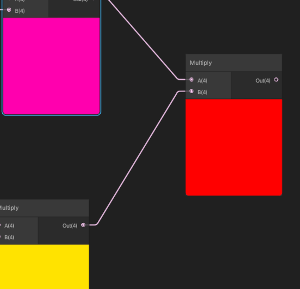

# 3. Recoloring Images

Let's take what we've learned so far and combine a texture and a color together to recolor an image. This example goes
through adding color to a black and white image.

The previous example in this tutorial is [Colored Shaders](2.ColoredShaders.md) which goes over adding basic colors to a
shader and material. The next example in this tutorial is [Combining Images](4.CombiningImages.md) which goes over
combining images together in a material.

## Scene Example

This example concerns Scene `3 - Recoloring Images` in the `Assets/Scenes` folder in the project. This scene contains
three sample boxes each with a recolored black and white image.


This example will show how we can recolor the white pixels in a black and white image. This shader takes two properties,
a black and white (also called grey scale) image and a color. The white pixels are changed to be the selected color and
grey pixels (anywhere between black and white) are tinted smoothly between the selected color and black.

Below is an animation showing how we can modify the color in the unity editor and observing the effects on the blue
cube. 



In the animation above, I am modifying the color property of the material and leaving the texture unchanged. The
grey scale version of the texture being modified is shown below:


## Recolor Images Shader

So, now that we've seen this shader in action, let's look at how it works. This scene uses an example shader called
`3 - Image Shader` and is saved at `Assets/shaders/3 - ImageShader.shadergraph`. As mentioned earlier, this shader has
two properties, a color and a texture. This shader then recolors all the white and grey pixels in that texture to be the
selected color. Below is an image showing how this shader graph works:


This shader uses the same Sample Texture 2D node shown in the first example. Then, this texture is combined with the
color using a `Multiply` panel.
A Multiply action is very simple, it takes in two numbers and multiplies them. The way that this works for colors is a
little different through. As we discussed earlier, a color is just three values (red, green, blue). The color black
represents no color for any value (0, 0, 0), the color white is shown by all colors (1, 1, 1). red is only red (1, 0,
0), green is only green (0, 1, 0), and blue is only blue (0, 0, 1).

The Multiply node will multiply two colors together to give us a new color. It does this by multiplying each of the
individual components (red, green, blue). Combining two colors together would look like this

```
Color 1 = (red1, green1, blue1)
Color 2 = (red2, green2, blue2)

Color 1 x Color 2 = (red1 x red2, green1 x green2, blue1 x blue 2)
```

Let's look at some examples
```
Red = (1, 0, 0)
White = (1, 1, 1)

Red * White = (1 * 1, 0 * 1, 0 * 1) = (1, 0, 0)
```

```
Red = (1, 0, 0)
Grey = (0.5, 0.5, 0.5)

Red * Grey = (0.5 * 1, 0.5 * 0, 0.5 * 0) = (0.5, 0, 0)
```

```
Yellow = (1, 1, 0)
Magenta = (1, 0, 1)

Yellow * Magenta = (1 * 1, 1 * 0, 0 * 1) = (1, 0, 0)
```

To show what this looks like for various colors, let's look at a few examples with the colors shown:

| Colors | Diagram |
|--------|---------|
| Red * White | |
| Red * Grey | |
| Magenta * Yellow| |

Now, after seeing these examples, we understand a bit more about how a grey scale image could be colored a different
color and smoothly transitioned to a different color.

## Next Example - Combine Images

The next example in this tutorial is [Combining Images](4.CombiningImages.md) which goes over
combining images together in a material.