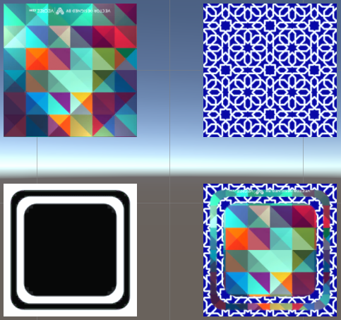
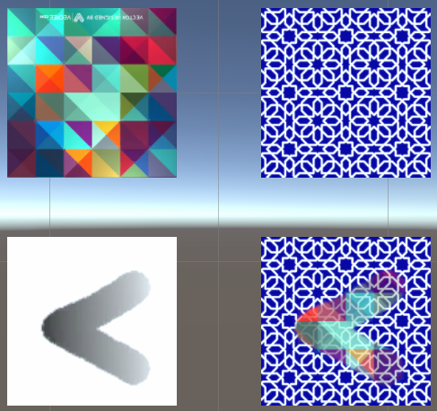
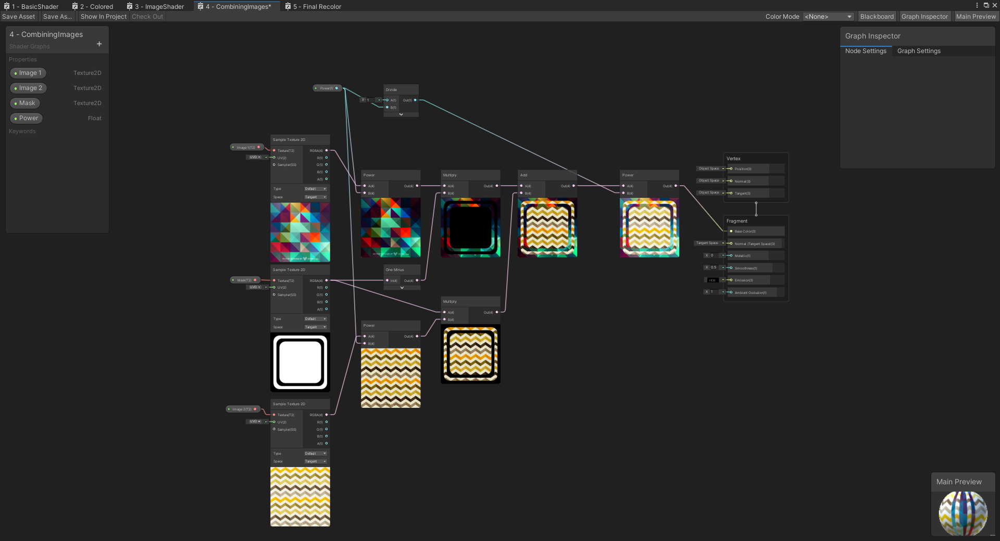
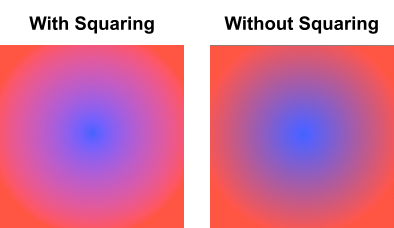

# 4. Combining Images

In this example we will be looking into combining two image textures into one for a shader graph. 

The previous example in this tutorial is [3 Recolor Images](3.RecoloringImages.md) which goes over how to recolor an image
in a shader and material. The next example in this tutorial is [5 Final Combination](5.FinalCombination.md) which goes
over how to recolor a black and white image two different colors.

## Scene Example

This example is shown in Scene `4 - Combining Images` in the `Assets/Scenes` folder in the project. The scene contains
two example cubes with patterns drawn on them and three cubes where the these images are combined using a design.

As seen in the the image above, two images can be combined using a design (also called a mask). This mask that combines
the image can be defined on a gradient (as seen in the cube on the far right with a radial pattern) or as static values
(as shown on the image on the far left).

The "mask" image defines which pixels should be selected. The mask image should be a grey scale image so each pixel can
be represented by a value between [0, 1] (black to white). Depending on the value of the pixel, we can either select the
image from the first image or the second image. below are two pictures of sampling to images based on different masks
and the masks of those images (shown in black and white).

This sample has an example where we select from the two different images using either full black or full white pixels.

This second sample has an example where we select from two different images using a gradient value.

## Recolor Images Shader

Combining two images according to a pattern is relatively straightforward, select from image 1 if the pixel is black,
select form image 2 otherwise. Although, there is a slight problem with this, color values (red, gree, blue) actually
represent intensity values that do not directly correspond to the correct color you would expect. In order to address
this issue, we have to first square the values before combining them, then applying a square root modifier afterwards.
If you want to know more about this, watch this great video [Computer Color is Broken](https://youtu.be/LKnqECcg6Gw) by Minute Physics:

<iframe width="560" height="315" src="https://www.youtube.com/embed/LKnqECcg6Gw" title="YouTube video player" frameborder="0" allow="accelerometer; autoplay; clipboard-write; encrypted-media; gyroscope; picture-in-picture" allowfullscreen></iframe>

Now that we have established this extra step in the process of color blending, we simply have to add this to our
process. Our shader for combining two images together is called `4 - CombiningImages` and is defined at
`Assets/Shaders/4 - CombiningImages.shadergraph`. As part of this shader, we mainly have three parameters, Image 1,
Image 2, and a mask image. A diagram of the shader is shown below:

The steps taken in the shader are defined as follow:
1. First these three images are taken into the program and first each sampled using teh Sample Texture 2D node.
2. After this, we use the Power node to square each of the pixel values in the textures.
3. In addition, we get the mask for image one and image 2 by applying a one minus node to the mask value. This give us
   the mask as well as the inverted mask (where black and white pixels are swapped).
4. Now that we have our masks ready, we color the white pixels the color of the provided image for the mask (and
   inverted mask for the second image). This can be visualized as the middle two images in the diagram above where each
   picture has a different pixels colored and black space where the other image is colored
5. Once we have the masks colored, we can combine these images by using a simple add operation (since we removed any
   overlapping pixels with the masks).
6. Finally, now that we have added our images together, we can apply the square root operation to the final image (or
   raising to a power of 1/2).

This process also works for masks that have grey values that are neither fully back nor fully white as shown in the
examples before. 

This is quite a complicated shader but does provide a visual example of combining two images then applying them to the
box. I additionally made the "power" parameter configurable so you can see what would happen if the square and square
root operations are not applied. It is most prominent when you are blending images together.

An example of this blending done with and without squaring is shown below. The image on the left side is with squaring
with the one on the right side is without squaring.

## Next Example - Final Combination

From this example, we have a basic understanding of how to combine two images using a mask and properly blend colors
between them. The next example in this tutorial is [Final Combination](5.FinalCombination.md) which goes
over how to recolor a black and white image two different colors.
