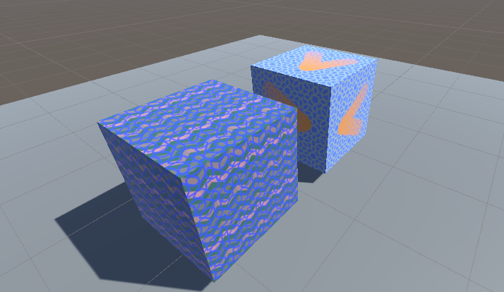

# 5. Final Combination

The previous example in this tutorial is [4 Combining Images](4.CombiningImages.md) which goes over
combining images together in a material.

## Scene Example

## Recolor Images Shader

## Concluding Remarks

## Bonus Examples

There are a few bonus examples in the Scene `6 - Bonus`, if you're interested check that scene and the related shaders
out.

