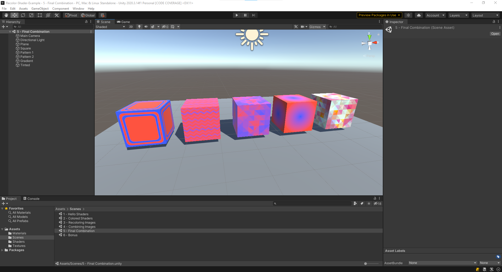

# 5. Final Combination

This final example shows how we can recolor a grey scale image using two different colors and blend between them
smoothly. We will be using information and techniques from all the previous examples in this project.

The previous example in this tutorial is [4 Combining Images](4.CombiningImages.md) which goes over
combining images together in a material.

## Scene Example

Alright, so the scene example that shows this is `5 - Final Combination`. This final combination scene has examples of
five different grey scale images being recolored to two different colors, a pastel blue and red color. Any area on the
images that were grey are evenly blended between the two colors.

> Fun side note, the last cube on the far right actually uses a color image to blend instead of just a grey scale. This
> tints the two colors used to be the color of the mask. Experiment more if you're interested in learning how it works
> and what new things you can do with it. 

The process for recoloring a grey scale image is very similar to the previous tutorial [4 Combining
Images](4.CombiningImages.md) but now we are using solid colors instead of an image and the mask defines the boundaries
between colors. There are many different uses for re-coloring grey scale images. One big use in games is that you can
allow for asset variations or player customization. Instead of having the same pattern repeated across your game over
and over, you can make a simple grey scale pattern and recolor it to as many different combinations of colors you like
making one image into many many assets. This could also be used to differentiate players to be on different color teams
without having to save separate image assets for each color variation. 

Just because I used the same two colors for each image above does not mean that you are limited. You can dynamically
change the material to be whatever two colors you want. below is an animation showing these color changes in action:

## Recolor Images Shader

As mentioned earlier, the shader for recoloring a grey scale image is quite similar to the combining images shader from
the previous tutorial. It takes in three parameters:
1. Recolor white
2. Recolor black
3. Albedo Texture

The texture is the grey scale image that represents which pixels will be colored the 'recolor white' and which pixels will
be colored the 'recolor black' colors.

The process is almost identical to that of combining images except we only take from a ingle color instead of full image
texture. Below is an image of the shader.

The above sample uses a grey scale version of the abstract triangle pattern as input and the colors red and yellow. The
white pixels of the original image are colored yellow, black pixels are colored red, grey pixels areas are blended
between yellow and red.

This shader also uses the technique of squaring and square root when combining the colors. This is much more significant
when combining solid colors as the blending errors are much easier to spot on solid colors. 

Although, you might ask, why use colors over full image maps? Well, colors can be easily modified and changed without
having to make full new images. Additionally, with one grey scale pattern, you can now make almost infinite combinations
of colors for new content. You could even recolor them based on events within the game such as weather, time of day, or
player customization giving much more freedom than simply combining static images. 

Feel free to experiment with the colors and modifying features within the existing scenes and examples. 

## Concluding Remarks

That is the conclusion going over how you can recolor a grey scale image using two different colors. Hopefully you have
enjoyed this tutorial. If you're interested in using this in your own project, feel free to download the latest release
from the [Release Page](https://github.com/nicholas-maltbie/Recolor-Shader-Example/releases) of this github repo. This
project is licensed under the MIT license and a few of the texture assets are drawn from creative commons library and
attributed in the `Assets/Recolor/Textures/references.txt`.

If you find any problems in the tutorial feedback is appreciated and open an issue or make a pull request with your
change. 

## Bonus Examples

There are a few bonus examples in the Scene `6 - Bonus`, if you're interested check that scene and the related shaders
out.

