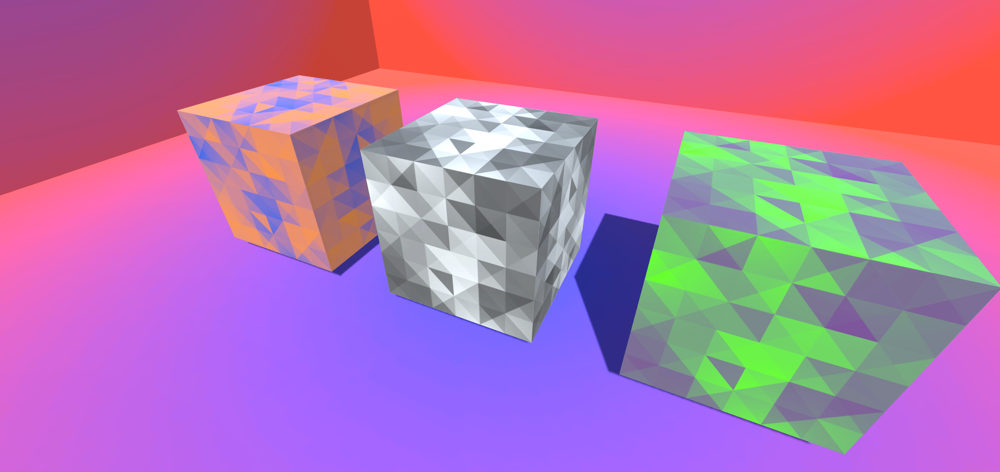

# Recolor Shader Example

This project demonstrates an example of how to use the Recolor shader developed in Unity's Universal Render Pipeline to recolor a grey scale image
using two different colors dynamically. 

This project is developed using Unity  [LTS Release 2020.3.14f1](https://unity3d.com/unity/whats-new/2020.3.14).
Install this version of Unity from Unity Hub using this unity hub link
[unityhub://2020.3.14f1/d0d1bb862f9d](unityhub://2020.3.14f1/d0d1bb862f9d)

This is an open source project licensed under a [MIT License](LICENSE.txt). Feel free to use a build of the project for
your own work. If you see an error in the project or have any suggestions, write an issue or make a pull request, I'll
happy include any suggestions or ideas into the project. 

# Examples

Here is a summary of the various examples in this project. Each link provides a tutorial on how part of the shader works
and the final link shows the completed shader in action.

1. [Hello Shaders](Examples/1.HelloShaders.md) - Basic Shader introduction.
2. [Colored Shaders](Examples/2.ColoredShaders.md) - Create a solid color shader. 
3. [Recoloring Images](Examples/3.RecoloringImages.md) - Recoloring a black and white image.
4. [Combining Images](Examples/4.CombiningImages.md) - Combining two images together.
5. [Final Combination](Examples/5.FinalCombination.md) - Recoloring a black and white image two different colors.

After going through these tutorials, you will know how to dynamically recolor grey scale using the shaders and materials in this project!

# Project Layout

Here is a description of the various directories in the project
* `Assets/Scenes` contains various scenes for the example project. Each scene is numbered and progress in order
  1, 2, ... This readme file will explain the assets in each scene. 
* `Assets/Shaders` contains the shaders for the project.
* `Assets/Materials` contains the materials for the project.
* `Assets/Textures` contains the image textures used in examples
